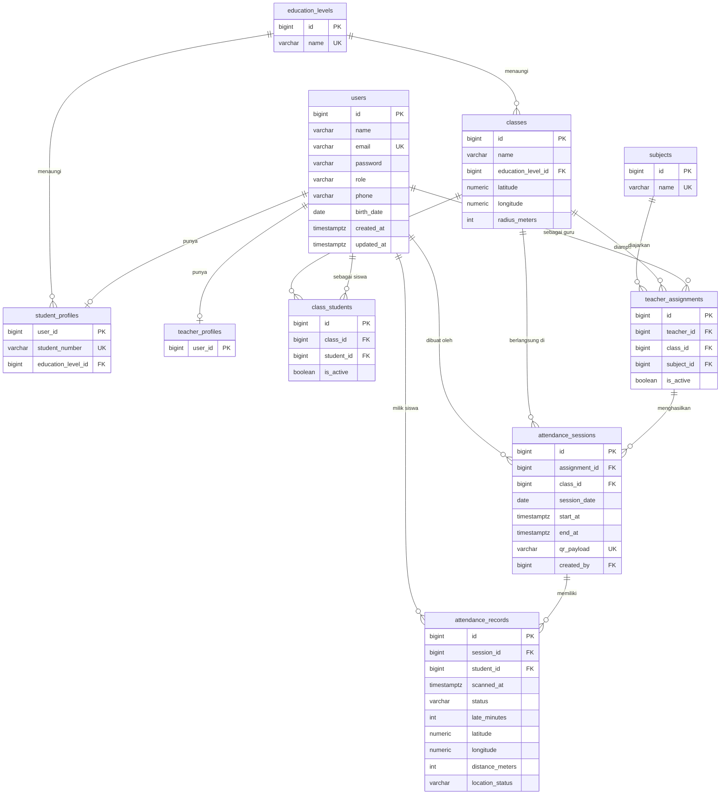

# Rancangan Proyek SiAbsen

Dokumen ini merupakan acuan kerja tim Kelompok SiAbsen untuk membangun aplikasi absensi sekolah berbasis QR code. Isi dokumen disusun berdasarkan kondisi nyata repositori (migrasi, seeder, model, dan stack aplikasi), bukan asumsi.

---

## 0. Identitas Kelompok

- **Nama Kelompok:** Kelompok SiAbsen
- **Repositori Git:** <https://github.com/lucas-backend/SiAbsen>

| Nama | NPM |
| --- | --- |
| I Made Dipa Rama Artike | 2415061001 |
| Rifki Yudika Perdana | 2415061090 |
| Riffa Yudika Perdana | 2415061091 |
| Arqan Purusa Eryan | 2415061055 |
| Yostiar Aminudin | 2415061016 |

---

## 1. Gambaran Umum Proyek

### 1.1 Tema

Pendidikan: sistem absensi berbasis QR code untuk sekolah. Aplikasi mencatat kehadiran siswa pada tiap sesi mata pelajaran, memverifikasi lokasi pemindaian, dan menyajikan rekapitulasi yang dapat difilter per kelas, periode, dan siswa.

### 1.2 Masalah yang Dijawab

Absensi konvensional yang dilakukan dengan memanggil nama atau menandatangani daftar hadir memakan waktu cukup lama di awal jam pelajaran. Setiap menit yang habis untuk pemanggilan siswa adalah waktu yang tidak terpakai untuk kegiatan belajar, sehingga waktu belajar efektif berkurang, terutama pada kelas besar dan jadwal yang padat.

Persoalan berikutnya muncul saat data absensi perlu diolah. Pencatatan dan perhitungan manual rawan terhadap kesalahan manusia (salah catat, salah hitung, atau daftar yang tercecer), dan menyusun rekapitulasi untuk periode tertentu—misalnya satu minggu atau satu bulan—menjadi pekerjaan yang melelahkan dan memakan waktu. Akibatnya, laporan kehadiran sering terlambat dan sulit dipertanggungjawabkan secara konsisten.

Masalah ketiga lebih serius: absensi yang hanya dilakukan sekali di pagi hari tidak mencegah seorang siswa meninggalkan sekolah di tengah jam pelajaran. Sistem absensi harian tidak memiliki cara memastikan siswa benar-benar hadir secara fisik saat pergantian mata pelajaran, sehingga peluang membolos tetap terbuka. SiAbsen menjawabnya dengan absensi per sesi pelajaran yang disertai verifikasi lokasi pemindaian, sehingga kehadiran bukan hanya tercatat, tetapi juga terverifikasi.

### 1.3 Entitas Utama

- **User (Siswa & Guru).** Menyimpan akun seluruh pengguna, mencakup identitas dasar (`name`, `email`, `password`) dan `role`. Kolom `role` membedakan sub-tipe pengguna; siswa dan guru berbagi entitas `users` yang sama, lalu diperkaya oleh tabel profil.
- **Kelas.** Menyimpan rombongan belajar pada suatu jenjang pendidikan (`classes`), dengan identitas unik berupa kombinasi `education_level_id` dan `name`. Kelas menjadi jembatan antara siswa, guru, dan sesi absensi.
- **Absensi.** Terdiri atas dua tingkat: `attendance_sessions` (sesi absensi statis yang menyimpan rentang waktu dan payload QR) dan `attendance_records` (hasil pemindaian siswa per sesi, memuat status dan waktu absen). Rancangan lokasi verifikasi dibahas di Bagian 2.

Perbedaan Siswa dan Guru terletak pada role dan tabel profil: Siswa memiliki `student_profiles` dengan `student_number` serta `education_level_id`, sedangkan Guru ditandai oleh `teacher_profiles`. Guru memiliki kewenangan mengajar dan mengelola absensi, sementara siswa hanya melakukan absensi dan melihat riwayatnya.

### 1.4 Peran Pengguna

| Peran | Kewenangan |
| --- | --- |
| Guru | Generate QR code absensi, kelola data siswa/kelas/jadwal, merekap absensi, memantau status kehadiran siswa secara realtime |
| Siswa | Melakukan absensi via scan QR code, melihat riwayat absen sendiri |

### 1.5 Relasi Antar Entitas

| Entitas A | Entitas B | Jenis Relasi | Implementasi di Repositori |
| --- | --- | --- | --- |
| User (Siswa) | Kelas | Many to Many | Tabel pivot `class_students` |
| User (Guru) | Kelas | One to Many | Tabel `teacher_assignments` (per mata pelajaran) |
| User (Siswa) | Absensi | One to Many | `attendance_records.student_id` |

**Alasan desain tiap relasi:**

- **Siswa–Kelas sebagai many-to-many.** Satu siswa dapat berpindah kelas sepanjang masa sekolah, dan satu kelas berisi banyak siswa. Karena itu hubungan tidak disimpan langsung di `users`, melainkan pada tabel pivot `class_students`. Pivot ini tidak sekadar memetakan dua id; ia membawa atribut tambahan `is_active` yang menandai penempatan yang sedang berlaku. Baris historis (`is_active = false`) tetap disimpan agar riwayat penempatan tidak hilang. Partial unique index `uq_class_students_active_student` (`student_id WHERE is_active`) menjamin satu siswa hanya memiliki satu penempatan aktif pada satu waktu. Repositori belum menyimpan atribut tahun ajaran secara eksplisit; bila nanti dibutuhkan (mis. untuk menandai tahun ajaran 2026/2027), kolom `academic_year` dapat ditambahkan pada pivot dan dijadikan bagian dari index keaktifan.
- **Guru–Kelas sebagai one-to-many (melalui penugasan).** Pada dasarnya seorang guru dapat mengampu beberapa kelas, tetapi konteks mengajar selalu melekat pada pasangan kelas dan mata pelajaran. Karena itu relasi tidak dibuat langsung guru–kelas, melainkan lewat tabel `teacher_assignments` yang menghubungkan `teacher_id`, `class_id`, dan `subject_id`. Dari sudut pandang satu guru, relasi ke kelas-kelas yang diampu bersifat satu-ke-banyak. Partial unique index `uq_teacher_assignments_active_assignment` mencegah duplikasi penugasan aktif untuk kombinasi guru, kelas, dan mata pelajaran yang sama.
- **Siswa–Absensi sebagai one-to-many.** Satu siswa menghasilkan banyak record absensi dari waktu ke waktu, sedangkan setiap record absensi hanya milik satu siswa. Relasi diwakili `attendance_records.student_id` dengan foreign key ke `users.id`. Unique `(session_id, student_id)` memastikan tidak ada record ganda untuk siswa yang sama pada sesi yang sama.

### 1.6 Alur Interaksi yang Dipilih

#### 1.6.1 Pencarian Bertingkat dan Alur Persetujuan

**Konteks.** Data akademik SiAbsen tersusun berjenjang. Pada skema yang ada, jenjang teratas adalah tingkat pendidikan (`education_levels`), lalu kelas (`classes`), lalu siswa (`users` yang berprofil `student_profiles` via `class_students`). Istilah "sekolah" pada hierarki umum dipetakan ke jenjang pendidikan; apabila SiAbsen nantinya dipakai untuk banyak sekolah, tabel `schools` dapat disisipkan di atas `education_levels`.

**Pencarian bertingkat (langkah per langkah):**

1. Guru membuka halaman pencarian data akademik.
2. Guru memilih jenjang pendidikan (mis. SD, SMP, SMA) pada filter tingkat pertama.
3. Sistem memuat daftar kelas (`classes`) yang `education_level_id`-nya sesuai pilihan tersebut, memanfaatkan index `uq_classes_education_level_name`.
4. Guru memilih kelas pada filter tingkat kedua.
5. Sistem memuat daftar siswa aktif kelas tersebut. Daftar diambil dari `class_students` yang `is_active = true`, di-join ke `student_profiles` untuk menampilkan `student_number`.
6. Guru memilih siswa untuk membuka detail (profil, riwayat absensi, dan aksi yang tersedia). Karena satu siswa hanya punya satu penempatan aktif, hasil pencarian bersifat tunggal dan tidak ambigu.

**Alur persetujuan.** SiAbsen memerlukan persetujuan agar siswa tidak bisa mengubah status kehadirannya secara sepihak. Alur yang dipilih:

1. Siswa mengajukan izin atau sakit, atau guru mengajukan koreksi status absensi yang salah.
2. Pengajuan masuk ke daftar menunggu dengan status "pending" dan berisi alasan serta bukti pendukung.
3. Guru (atau admin) meninjau pengajuan melalui pencarian bertingkat di atas untuk memastikan permintaan memang terkait siswa dan sesi yang benar.
4. Guru menyetujui atau menolak. Bila disetujui, sistem menulis/memperbarui record absensi terkait dengan status yang sesuai (mis. `IZIN` atau `SAKIT`) dan mencatat siapa yang menyetujui.
5. Keputusan tersimpan sebagai jejak audit agar perubahan status dapat dipertanggungjawabkan.

> Catatan: skema saat ini belum memiliki tabel pengajuan/persetujuan. Rancangan tabel pendukungnya diusulkan pada Bagian 2 (2.9) dan ditandai sebagai rencana.

#### 1.6.2 Halaman Rekap

**Alur guru/pihak sekolah mengakses rekap (langkah per langkah):**

1. Guru membuka halaman rekap absensi.
2. Guru menentukan konteks data lewat filter bertingkat: jenjang pendidikan, kelas, mata pelajaran (opsional), dan periode tanggal, serta siswa tertentu bila diperlukan.
3. Sistem menarik `attendance_sessions` pada rentang tanggal yang dipilih, lalu mengumpulkan `attendance_records` dari sesi-sesi tersebut.
4. Untuk setiap entri, sistem menampilkan status kehadiran (`HADIR`, `TERLAMBAT`, `TIDAK_HADIR`, dan status hasil persetujuan seperti `IZIN`/`SAKIT`) beserta waktu absen (`scanned_at`).
5. Sistem menampilkan kecocokan lokasi verifikasi untuk tiap entri: apakah pemindaian terjadi "sesuai lokasi kelas" atau "di luar radius" (lihat rancangan lokasi di Bagian 2), sehingga guru dapat mengenali anomali.
6. Guru meninjau ringkasan (jumlah hadir, terlambat, tidak hadir, dan lain-lain) serta menelusuri detail per siswa.
7. Bila ditemukan ketidaksesuaian, guru dapat membuka pengajuan koreksi (alur persetujuan pada 1.6.1) atau mengekspor data rekap untuk pelaporan.

Halaman rekap dijelaskan lebih rinci pada Bagian 6.

---

## 2. Rancangan Skema Basis Data

Bagian ini memuat rancangan skema untuk entitas User, Kelas, Absensi, dan tabel pendukung. Kolom bertanda **[rencana]** belum ada di migrasi saat ini dan merupakan usulan perbaikan; kolom tanpa tanda tersebut sudah tersedia di repositori.

Konvensi dasar: primary key domain memakai `BIGINT` identity, waktu memakai `TIMESTAMPTZ(6)`, dan nama objek `snake_case`.

### 2.1 `users`

| Atribut | Tipe Data | Kunci | Nullable | Alasan Pemilihan Tipe Data | Batasan Integritas |
| --- | --- | --- | --- | --- | --- |
| `id` | BIGINT identity | PK | Tidak | Cukup besar untuk akun jangka panjang dan konsisten dengan tabel lain | Auto increment |
| `name` | VARCHAR(255) | — | Tidak | Nama orang tidak butuh tipe khusus; 255 aman untuk nama panjang | Wajib diisi |
| `email` | VARCHAR(255) | Unique | Tidak | Identitas login; panjang standar email | Harus unik, dipakai Fortify |
| `email_verified_at` | TIMESTAMPTZ(6) | — | Ya | Waktu verifikasi membutuhkan zona waktu | — |
| `password` | VARCHAR(255) | — | Tidak | Menyimpan hash, bukan teks asli | Selalu hash via cast `hashed` |
| `role` | VARCHAR(20) / enum `user_role` | Index | Tidak | Nilai terbatas; migrasi memakai VARCHAR(20), DDL target memakai native enum | Index `idx_users_role`; nilai valid STUDENT/TEACHER/ADMIN |
| `phone` | VARCHAR(30) | — | Ya | Nomor telepon fleksibel antar format | — |
| `birth_date` | DATE | — | Ya | Hanya butuh tanggal, tanpa waktu | — |
| `remember_token` | VARCHAR(100) | — | Ya | Token "remember me" | — |
| `created_at` | TIMESTAMPTZ(6) | — | Tidak | Waktu dibuat dengan zona waktu | Default `CURRENT_TIMESTAMP(6)` |
| `updated_at` | TIMESTAMPTZ(6) | — | Tidak | Waktu diubah | Dikelola Eloquent |

### 2.2 `student_profiles`

| Atribut | Tipe Data | Kunci | Nullable | Alasan Pemilihan Tipe Data | Batasan Integritas |
| --- | --- | --- | --- | --- | --- |
| `user_id` | BIGINT | PK, FK `users.id` | Tidak | Satu akun maksimal satu profil siswa | `ON DELETE CASCADE` |
| `student_number` | VARCHAR(50) | Unique | Tidak | Nomor induk siswa bisa mengandung huruf/angka | Unik |
| `education_level_id` | BIGINT | FK `education_levels.id` | Tidak | Menandai jenjang siswa | `ON DELETE RESTRICT` |

### 2.3 `teacher_profiles`

| Atribut | Tipe Data | Kunci | Nullable | Alasan Pemilihan Tipe Data | Batasan Integritas |
| --- | --- | --- | --- | --- | --- |
| `user_id` | BIGINT | PK, FK `users.id` | Tidak | Menandai akun berperan guru | `ON DELETE CASCADE` |

### 2.4 `education_levels`

| Atribut | Tipe Data | Kunci | Nullable | Alasan Pemilihan Tipe Data | Batasan Integritas |
| --- | --- | --- | --- | --- | --- |
| `id` | BIGINT identity | PK | Tidak | — | Auto increment |
| `name` | VARCHAR(100) | Unique | Tidak | Nama jenjang (SD/SMP/SMA) | Unik |

### 2.5 `classes`

| Atribut | Tipe Data | Kunci | Nullable | Alasan Pemilihan Tipe Data | Batasan Integritas |
| --- | --- | --- | --- | --- | --- |
| `id` | BIGINT identity | PK | Tidak | — | Auto increment |
| `name` | VARCHAR(100) | — | Tidak | Nama kelas (mis. "Kelas 10 MIPA 1") | Unik per jenjang |
| `education_level_id` | BIGINT | FK `education_levels.id` | Tidak | Kelas selalu milik satu jenjang | `ON DELETE RESTRICT`; bagian unique (`education_level_id`, `name`) |
| `latitude` | NUMERIC(10,7) | — | Ya | **[rencana]** Presisi 7 desimal setara akurasi GPS; titik pusat geofence kelas | — |
| `longitude` | NUMERIC(10,7) | — | Ya | **[rencana]** Sama seperti latitude | — |
| `radius_meters` | INTEGER | — | Ya | **[rencana]** Radius toleransi geofence dalam meter | Default nilai aman (mis. 50); tidak negatif |

### 2.6 `subjects`

| Atribut | Tipe Data | Kunci | Nullable | Alasan Pemilihan Tipe Data | Batasan Integritas |
| --- | --- | --- | --- | --- | --- |
| `id` | BIGINT identity | PK | Tidak | — | Auto increment |
| `name` | VARCHAR(150) | Unique | Tidak | Nama mata pelajaran | Unik |

### 2.7 `class_students` (pivot Siswa–Kelas)

| Atribut | Tipe Data | Kunci | Nullable | Alasan Pemilihan Tipe Data | Batasan Integritas |
| --- | --- | --- | --- | --- | --- |
| `id` | BIGINT identity | PK | Tidak | Memudahkan referensi pivot | Auto increment |
| `class_id` | BIGINT | FK `classes.id` | Tidak | Kelas penempatan | `ON DELETE RESTRICT` |
| `student_id` | BIGINT | FK `users.id` | Tidak | Siswa yang ditempatkan | `ON DELETE RESTRICT` |
| `is_active` | BOOLEAN | — | Tidak | Menandai penempatan aktif vs historis | Default `TRUE`; partial unique `(student_id) WHERE is_active` |
| `academic_year` | VARCHAR(9) | — | Ya | **[rencana]** Menandai tahun ajaran (mis. "2026/2027") agar riwayat antar tahun jelas | Bila diaktifkan, masukkan ke dalam unique keaktifan |

### 2.8 `teacher_assignments` (pivot Guru–Kelas–Mata Pelajaran)

| Atribut | Tipe Data | Kunci | Nullable | Alasan Pemilihan Tipe Data | Batasan Integritas |
| --- | --- | --- | --- | --- | --- |
| `id` | BIGINT identity | PK | Tidak | Dirujuk sesi absensi | Auto increment; unique `(id, class_id)` untuk FK komposit |
| `teacher_id` | BIGINT | FK `users.id` | Tidak | Guru pengampu | `ON DELETE RESTRICT` |
| `class_id` | BIGINT | FK `classes.id` | Tidak | Kelas yang diampu | `ON DELETE RESTRICT` |
| `subject_id` | BIGINT | FK `subjects.id` | Tidak | Mata pelajaran yang diampu | `ON DELETE RESTRICT` |
| `is_active` | BOOLEAN | — | Tidak | Penugasan aktif vs historis | Default `TRUE`; partial unique `(teacher_id, class_id, subject_id) WHERE is_active` |

### 2.9 Tabel Pendukung Alur Persetujuan — `attendance_requests` **[rencana]**

Belum ada di repositori. Diusulkan agar alur persetujuan pada 1.6.1 memiliki tempat penyimpanan.

| Atribut | Tipe Data | Kunci | Nullable | Alasan Pemilihan Tipe Data | Batasan Integritas |
| --- | --- | --- | --- | --- | --- |
| `id` | BIGINT identity | PK | Tidak | — | Auto increment |
| `session_id` | BIGINT | FK `attendance_sessions.id` | Tidak | Sesi yang dikoreksi | `ON DELETE CASCADE` |
| `student_id` | BIGINT | FK `users.id` | Tidak | Siswa pengaju | `ON DELETE CASCADE` |
| `requested_status` | VARCHAR(20) | — | Tidak | Status yang diajukan (mis. `IZIN`, `SAKIT`) | Nilai terbatas |
| `reason` | TEXT | — | Ya | Alasan pengajuan | — |
| `status` | VARCHAR(20) | — | Tidak | `PENDING`/`APPROVED`/`REJECTED` | Default `PENDING` |
| `reviewed_by` | BIGINT | FK `users.id` | Ya | Guru/admin peninjau | `ON DELETE SET NULL` |
| `reviewed_at` | TIMESTAMPTZ(6) | — | Ya | Waktu keputusan | — |

### 2.10 `attendance_sessions` (Sesi Absensi)

| Atribut | Tipe Data | Kunci | Nullable | Alasan Pemilihan Tipe Data | Batasan Integritas |
| --- | --- | --- | --- | --- | --- |
| `id` | BIGINT identity | PK | Tidak | Dirujuk record absensi | Auto increment |
| `assignment_id` | BIGINT | FK komposit | Tidak | Menentukan guru, kelas, mapel sesi | FK `(assignment_id, class_id)` → `teacher_assignments (id, class_id)` |
| `class_id` | BIGINT | FK `classes.id` | Tidak | Kelas sesi | `ON DELETE RESTRICT`; selalu konsisten dengan assignment |
| `session_date` | DATE | — | Tidak | Tanggal kalender sesi (timezone sekolah), tanpa jam | Bagian unique `(assignment_id, session_date, start_at, end_at)` |
| `start_at` | TIMESTAMPTZ(6) | — | Tidak | Instan mulai sesi | Harus lebih awal dari `end_at`; bagian unique |
| `end_at` | TIMESTAMPTZ(6) | — | Tidak | Instan selesai sesi | Harus lebih besar dari `start_at` |
| `qr_payload` | VARCHAR(255) | Unique | Tidak | Token payload QR sesi | Unik |
| `created_by` | BIGINT | FK `users.id` | Tidak | Guru pembuat sesi | `ON DELETE RESTRICT` |
| `latitude` | NUMERIC(10,7) | — | Ya | **[rencana]** Pusat lokasi yang diharapkan saat sesi dibuat | — |
| `longitude` | NUMERIC(10,7) | — | Ya | **[rencana]** Sama seperti latitude | — |

### 2.11 `attendance_records` (Absensi / Hasil Pemindaian)

| Atribut | Tipe Data | Kunci | Nullable | Alasan Pemilihan Tipe Data | Batasan Integritas |
| --- | --- | --- | --- | --- | --- |
| `id` | BIGINT identity | PK | Tidak | — | Auto increment |
| `session_id` | BIGINT | FK `attendance_sessions.id` | Tidak | Sesi yang diikuti | `ON DELETE RESTRICT`; bagian unique `(session_id, student_id)` |
| `student_id` | BIGINT | FK `users.id` | Tidak | Siswa yang hadir | `ON DELETE RESTRICT` |
| `scanned_at` | TIMESTAMPTZ(6) | — | Tidak | Waktu absen (dari server); butuh zona waktu | Wajib diisi; lihat catatan perbaikan Bagian 3 |
| `status` | VARCHAR(20) / enum `attendance_status` | — | Tidak | Nilai terbatas | `HADIR`, `TERLAMBAT`, `TIDAK_HADIR` (+ `IZIN`/`SAKIT` rencana persetujuan) |
| `late_minutes` | INTEGER | — | Ya | Selisih menit keterlambatan | Check `late_minutes IS NULL OR late_minutes >= 0` |
| `latitude` | NUMERIC(10,7) | — | Ya | **[rencana]** Koordinat siswa saat memindai | — |
| `longitude` | NUMERIC(10,7) | — | Ya | **[rencana]** Koordinat siswa saat memindai | — |
| `distance_meters` | INTEGER | — | Ya | **[rencana]** Jarak hasil hitung ke pusat lokasi kelas | Tidak negatif |
| `location_status` | VARCHAR(20) | — | Ya | **[rencana]** `SESUAI` / `DI_LUAR_RADIUS` / `TIDAK_TERVERIFIKASI` | Nilai terbatas |
| `created_at` | TIMESTAMPTZ(6) | — | Tidak | — | Default `CURRENT_TIMESTAMP(6)` |
| `updated_at` | TIMESTAMPTZ(6) | — | Tidak | — | Dikelola Eloquent |

### 2.12 Diagram ERD



Catatan: `latitude`, `longitude`, `radius_meters`, `distance_meters`, dan `location_status` adalah kolom **[rencana]** yang belum ada di migrasi.

---

## 3. Migrasi & Seeder (Verifikasi)

> Bagian ini bersifat verifikasi. Migrasi dan seeder tidak dibuat ulang.

### 3.1 Perintah Migrasi

Perintah standar dari kondisi bersih:

```bash
php artisan migrate:fresh --seed
```

Bila dijalankan bertahap:

```bash
php artisan migrate:fresh
php artisan db:seed
```

### 3.2 Hasil Verifikasi

Verifikasi dijalankan pada lingkungan pengembangan tim. Catatan lingkungan: instalasi PHP yang aktif (Herd Lite) belum mengaktifkan ekstensi `pdo_pgsql`, sehingga koneksi `pgsql` menghasilkan `could not find driver`. Karena itu eksekusi verifikasi dialihkan ke koneksi SQLite in-memory dengan perintah berikut:

```powershell
$env:DB_CONNECTION='sqlite'; $env:DB_DATABASE=':memory:'; php artisan migrate:fresh --seed
```

**Status migrasi: berhasil.** Seluruh 12 migrasi berjalan tanpa error, mulai dari tabel internal Laravel (users, cache, jobs) hingga 9 migrasi domain:

```
0001_01_01_000000_create_users_table ......... DONE
0001_01_01_000001_create_cache_table ......... DONE
0001_01_01_000002_create_jobs_table .......... DONE
2026_09_25_000001_create_education_levels_table .... DONE
2026_09_25_000002_create_student_profiles_table .... DONE
2026_09_25_000003_create_teacher_profiles_table .... DONE
2026_09_25_000004_create_classes_table ............. DONE
2026_09_25_000005_create_subjects_table ............ DONE
2026_09_25_000006_create_class_students_table ...... DONE
2026_09_25_000007_create_teacher_assignments_table . DONE
2026_09_25_000008_create_attendance_sessions_table . DONE
2026_09_25_000009_create_attendance_records_table .. DONE
```

**Status seeder: gagal.** Seeder berhenti pada penyisipan `attendance_records` dengan error:

```
SQLSTATE[23000]: Integrity constraint violation:
NOT NULL constraint failed: attendance_records.scanned_at
```

Penyebab: `attendance_records.scanned_at` didefinisikan `NOT NULL`, tetapi `DatabaseSeeder` mengisi `null` ketika status bernilai `TIDAK_HADIR`:

```php
'scanned_at' => $status === 'TIDAK_HADIR' ? null : clone $sessionDate->addMinutes(rand(0, 30)),
```

Kesalahan ini bersifat lintas-database: PostgreSQL juga akan menolak `NULL` pada kolom `NOT NULL`, sehingga `migrate:fresh --seed` akan gagal pada PostgreSQL dengan pesan setara. Agar konsisten, migrasi `pgsql` perlu diverifikasi ulang setelah `pdo_pgsql` diaktifkan.

### 3.3 Kecukupan Data Contoh (setelah perbaikan)

Bila seeder diperbaiki, `DatabaseSeeder` sudah menghasilkan data yang memadai untuk demo:

| Data | Jumlah | Sumber |
| --- | --- | --- |
| Jenjang pendidikan | 3 (SD, SMP, SMA) | `DatabaseSeeder` |
| Kelas | 12 (4 per jenjang) | `DatabaseSeeder` |
| Mata pelajaran | 8 | `DatabaseSeeder` |
| Admin | 1 (`admin@siabsen.com`) | `DatabaseSeeder` |
| Guru | 10 (`guru1`–`guru10`) | `DatabaseSeeder` |
| Siswa | 120 (10 per kelas) | `DatabaseSeeder` |
| Profil guru / siswa | 10 / 120 | `DatabaseSeeder` |
| Penempatan kelas aktif | 120 | `class_students` |
| Penugasan guru | 24 (2 per kelas) | `teacher_assignments` |
| Sesi absensi | 120 (5 per penugasan) | `attendance_sessions` |
| Riwayat absensi | ~1.200 (10 siswa × 5 sesi × 2 penugasan × 12 kelas) | `attendance_records` |

Seluruh akun memakai password `password`. Jumlah ini cukup untuk mendemokan pencarian bertingkat, sesi absensi, dan rekap multi-hari (sesi tersebar 1–30 hari ke belakang).

### 3.4 Catatan Perbaikan (Ketidaksesuaian Seeder vs Rancangan Bagian 2)

| # | Temuan | Dampak | Usulan Perbaikan |
| --- | --- | --- | --- |
| 1 | `seeder` mengisi `scanned_at = null` untuk `TIDAK_HADIR`, padahal kolom `NOT NULL` | `migrate:fresh --seed` gagal | Ubah `scanned_at` menjadi nullable, atau isi `scanned_at` dengan waktu sesi untuk semua status, atau jangan simpan `TIDAK_HADIR` di record (hitung saat baca) |
| 2 | Seeder menyimpan `TIDAK_HADIR` langsung ke `attendance_records` | Bertentangan dengan aturan domain bahwa `TIDAK_HADIR` dihitung saat pembacaan, bukan hasil scan | Untuk demo, tambahkan penanda bahwa ini data contoh; pada service nyata, `TIDAK_HADIR` dihitung on-the-fly |
| 3 | Tidak ada kolom lokasi verifikasi pada skema mana pun | Fitur "kecocokan lokasi" di halaman rekap tidak dapat dibangun | Tambahkan kolom lokasi/geofence pada `classes` dan `attendance_records` (Bagian 2.5 dan 2.11) |
| 4 | Sesi dibuat dengan tanggal acak 1–30 hari tanpa pengecekan duplikat | Berpotensi melanggar unique `(assignment_id, session_date, start_at, end_at)` dan menghentikan seeder | Pastikan tanggal unik per assignment, mis. pakai indeks hari berurutan |
| 5 | Migrasi memakai `VARCHAR(20)` untuk `role` dan `status`, sedangkan DDL target memakai native enum | Tipe dan validasi bisa berbeda antara runtime dan DDL | Samakan strategi: pakai enum PostgreSQL atau check constraint yang setara |
| 6 | Tidak ada tabel pengajuan/persetujuan | Alur persetujuan (1.6.1) belum memiliki tempat penyimpanan | Tambahkan `attendance_requests` (Bagian 2.9) |
| 7 | `User` belum punya cast enum `role`, relasi Eloquent, atau helper otorisasi | Registrasi/otorisasi berbasis peran belum aman | Tambahkan enum cast, relasi, dan policy saat domain diimplementasikan |
| 8 | Check constraint `end_at > start_at` dan `late_minutes >= 0` masih dikomentari di migrasi | Aturan integritas belum ditegakkan database | Aktifkan check constraint setelah verifikasi di PostgreSQL |

---

## 4. Pembagian Peran Tim

Data pembagian peran dipertahankan apa adanya. Karena beberapa anggota memegang lebih dari satu peran, peran utama tiap anggota ditandai tebal agar selaras dengan prinsip satu peran utama per orang; peran lainnya menjadi pendukung.

| Peran | Anggota |
| --- | --- |
| Basis Data & Model | **Arqan**, **Riffa**, Dipa, Rifki |
| Antarmuka & Komponen | **Dipa**, **Rifki**, Yostiar |
| Autentikasi & Otorisasi | **Arqan**, Yostiar |
| Uji Kebergunaan | **Arqan**, **Dipa**, **Riffa**, **Rifki**, **Yostiar** |
| Dokumentasi | **Yostiar**, Rifki |

**Ringkasan peran utama per anggota:**

| Anggota | Peran Utama | Peran Pendukung |
| --- | --- | --- |
| Arqan Purusa Eryan | Basis Data & Model | Autentikasi & Otorisasi, Uji Kebergunaan |
| I Made Dipa Rama Artike | Antarmuka & Komponen | Basis Data & Model, Uji Kebergunaan |
| Riffa Yudika Perdana | Basis Data & Model | Uji Kebergunaan |
| Rifki Yudika Perdana | Antarmuka & Komponen | Basis Data & Model, Dokumentasi, Uji Kebergunaan |
| Yostiar Aminudin | Dokumentasi | Antarmuka & Komponen, Autentikasi & Otorisasi, Uji Kebergunaan |

Seluruh anggota terlibat pada Uji Kebergunaan sebagai peran bersama.

---

## 5. Calon Pengguna untuk Uji Kebergunaan (Pertemuan 13)

Calon peserta berikut sudah menyatakan bersedia. Nama asli akan dikonfirmasi sebelum pertemuan 13.

| Sebutan | Nama Asli (isi sebelum pertemuan 13) | Tanggal Konfirmasi |
| --- | --- | --- |
| Bapak Guru (perwakilan guru laki-laki) | `[ISI_NAMA]` | |
| Ibu Guru (perwakilan guru perempuan) | `[ISI_NAMA]` | |
| Perwakilan Siswa Kelas X | `[ISI_NAMA]` | |
| Perwakilan Siswa Kelas XI | `[ISI_NAMA]` | |
| Perwakilan Siswa Kelas XII | `[ISI_NAMA]` | |

Rencana pelaksanaan: guru mencoba membuat sesi absensi dan membuka halaman rekap, sedangkan siswa mencoba memindai QR dan melihat riwayat absen. Masukan dari kelima peserta menjadi bahan penyempurnaan antarmuka sebelum evaluasi akhir.

---

## 6. Isi Halaman Rekap

Halaman rekap adalah pusat pemantauan kehadiran. Komponen yang akan dibangun:

### 6.1 Tabel Riwayat dan Rekapitulasi Status

- Setiap baris merepresentasikan satu entri absensi: siswa, sesi (tanggal, mata pelajaran, kelas), dan statusnya.
- Status yang ditampilkan: `HADIR`, `TERLAMBAT`, `TIDAK_HADIR`, serta `IZIN` dan `SAKIT` bila alur persetujuan sudah menghasilkan status tersebut.
- Untuk `TERLAMBAT`, ditampilkan `late_minutes` (menit keterlambatan).
- Tersedia ringkasan agregat: jumlah hadir, terlambat, tidak hadir, izin, dan sakit, serta persentase kehadiran per siswa atau per kelas pada periode terpilih.
- Waktu absen (`scanned_at`) ditampilkan dalam zona waktu sekolah.

### 6.2 Informasi Kecocokan Lokasi Verifikasi

- Setiap entri menampilkan status lokasi: **"sesuai lokasi kelas"** (`SESUAI`) atau **"di luar radius"** (`DI_LUAR_RADIUS`), dengan opsi `TIDAK_TERVERIFIKASI` bila data lokasi tidak tersedia.
- Ditampilkan pula `distance_meters` (jarak pemindaian ke pusat lokasi kelas) dan, bila perlu, tautan peta ke koordinat pemindaian.
- Informasi ini memungkinkan guru mengenali entri mencurigakan, misalnya siswa yang statusnya hadir tetapi memindai dari luar radius kelas.
- Fitur ini bergantung pada kolom lokasi **[rencana]** pada Bagian 2, sehingga implementasinya mengikuti penyelesaian catatan perbaikan nomor 3.

### 6.3 Filter yang Tersedia

- **Per jenjang pendidikan:** SD, SMP, SMA.
- **Per kelas:** mengikuti jenjang yang dipilih (filter bertingkat).
- **Per mata pelajaran** (opsional), mengikuti penugasan guru.
- **Per periode/tanggal:** rentang tanggal atau hari tertentu, memanfaatkan `attendance_sessions.session_date`.
- **Per siswa:** untuk menampilkan riwayat satu siswa.
- **Per status kehadiran:** memfilter hanya entri dengan status tertentu.

### 6.4 Hak Akses

- **Guru:** mengakses rekap untuk kelas dan mata pelajaran yang diampu sesuai `teacher_assignments` aktif.
- **Admin/pihak sekolah:** mengakses seluruh rekap lintas jenjang dan kelas.
- **Siswa:** tidak mengakses halaman rekap; siswa hanya melihat riwayat absennya sendiri pada halaman terpisah.
- Otorisasi ditegakkan di sisi server (policy/controller) berdasarkan `role` dan relasi penugasan, bukan hanya disembunyikan di antarmuka.

---

## 7. Keputusan Arsitektur

### 7.1 Arsitektur yang Dipilih

**Monolit Inertia** (Laravel 13 + Inertia.js 3 + React 19 + TypeScript). Keputusan ini sesuai dengan stack yang sudah ada di repositori:

- `composer.json`: `laravel/framework ^13.17`, `inertiajs/inertia-laravel ^3.0`, `laravel/fortify`, `laravel/wayfinder`.
- `package.json`: `@inertiajs/react ^3.0.0`, `react ^19.2.0`, `vite ^8.0.0`.

Inertia menyatukan backend Laravel dan frontend React dalam satu codebase dan satu proses deploy, tanpa membangun API terpisah.

### 7.2 Dua Alasan Teknis

1. **Kebutuhan antarmuka interaktif (scan QR dan pemantauan) terpenuhi tanpa membangun API terpisah.** Pemindaian QR memerlukan akses kamera, umpan balik instan, dan validasi klien, sementara pemantauan kehadiran menuntut UI yang responsif. Inertia + React memberi komponen interaktif penuh dengan routing, validasi, dan otentikasi server yang sudah terintegrasi (Fortify), sehingga tim tidak perlu mendefinisikan dan memelihara kontrak REST serta autentikasi token terpisah.
2. **Kecepatan pengembangan tim beranggotakan 5 orang.** Dengan satu codebase dan tanpa duplikasi lapisan API, anggota dapat bekerja lintas backend dan frontend memakai route Laravel serta generate Wayfinder. Ini mengurangi overhead koordinasi kontrak API, mempercepat iterasi, dan memanfaatkan kembali komponen UI yang sudah ada (mis. shadcn/ui dan Radix pada `package.json`).

### 7.3 Satu Hal yang Dikorbankan

**Ketiadaan API publik terpisah menyulitkan pemakaian klien non-web (mobile native) dan membatasi SSR/SEO.** Karena halaman dirender sebagai komponen Inertia yang bergantung pada sesi Laravel, aplikasi mobile native atau integrasi pihak ketiga tidak dapat langsung dikonsumsi tanpa menambah lapisan API di kemudian hari. Konsekuensi ini dapat diterima untuk skala proyek sekolah saat ini karena sasaran utama adalah satu aplikasi web dengan kamera browser (bukan aplikasi native) dan halaman rekap yang bersifat internal—bukan konten publik yang butuh SEO—sehingga nilai kecepatan pengembangan lebih besar daripada kebutuhan decoupling frontend-backend.
